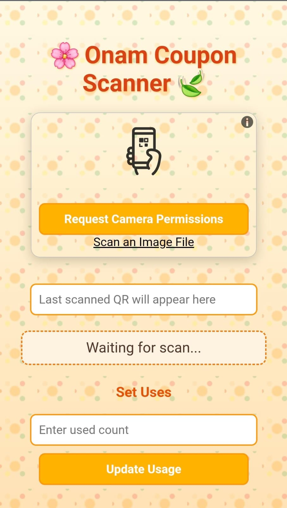
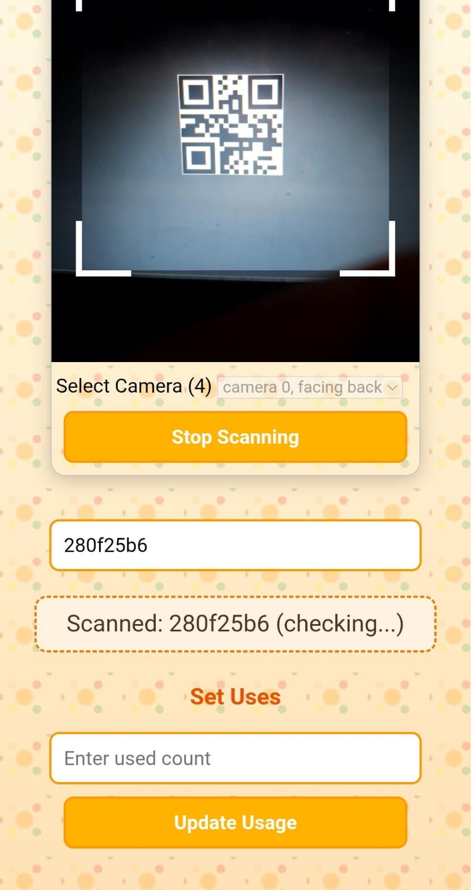
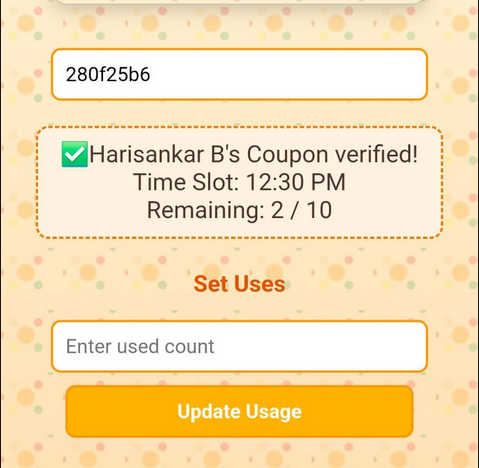
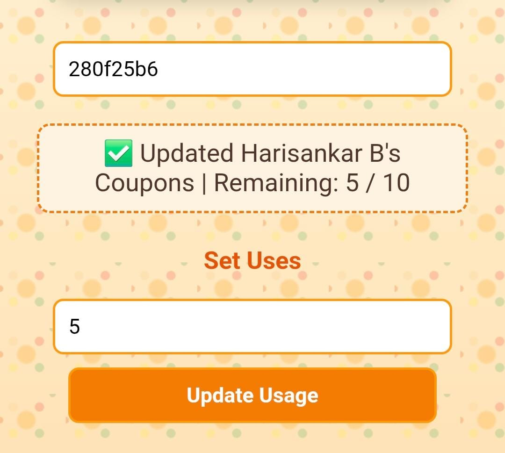

# QR-Coupon-Scanner

A lightweight **QR-based event management system** that uses **Google Sheets + Google Apps Script** as the backend and a simple static webpage as the frontend for scanning and verifying coupons.

You can easily host the frontend as a static page on **GitHub Pages** - just upload the contents of the `frontend` folder to your repository and enable GitHub Pages. No server setup is needed. The static HTML and JavaScript send requests directly to your Google Apps Script Web App endpoint, allowing real-time coupon validation and usage tracking right from the browser.

---

## ✨ Features

- **Automatic Coupon Generation**  
  Each participant is assigned a unique coupon ID and QR code.

- **Email Distribution**  
  QR coupons are automatically emailed to participants as attachments.

- **Real-time Scan Validation**  
Volunteers scan coupons using a browser-based QR scanner. The scan is validated against Google Sheets instantly.



(All prettification CSS has been removed. Screenshot taken from an actual event)


- **Usage Tracking**  
    Each coupon has a limited number of uses (e.g., for multiple meals or entries). Remaining uses are updated live in the sheet.






- **Manual Adjustments**  
  Volunteers can manually set/update usage counts through the frontend page.



- **No server hosting required**  
  Runs entirely on **Google’s free infrastructure**.


## 🚀 Installation & Setup
### 1. Backend (Google Apps Script)
1. Create a new Google Sheet and name it **`Coupons`**.
2. Add the following columns to the sheet:  
    - **A:** Name  
    - **B:** Email  
    - **C:** Count  
    - **D:** Slot  
    - **E:** CouponID  
    - **F:** QR  
    - **G:** Mail Status  
    - **H:** Remaining  
3. In the Google Sheet, go to **Extensions → Apps Script**.
4. Replace the default `Code.gs` with the contents of `backend/Code.gs`.
5. Deploy as a **Web App**:  
    - Go to **Deploy → New deployment → Web app**.  
    - Set **Execute as:** Me.  
    - Set **Who has access:** Anyone with the link.  
    - Copy the **Web App URL**.

> **Note:** The first time you run functions like `generateCoupons()` or `sendCoupons()`, Google Apps Script will prompt you to review and authorize the required permissions. These permissions allow the script to access your Google Sheets and send emails on your behalf. Make sure to review the access scopes and grant permission using your Google account. Without these authorizations, features like coupon generation and email distribution will not 


6. In the Apps Script editor, run `generateCoupons()` to create unique coupon IDs and QR codes for each participant.
7. After coupons are generated, run `sendCoupons()` to email the QR coupons to all participants.


### 2. Frontend (Static Page)
1. Open `frontend/script.js`.  
2. Replace the `WEB_APP_URL` value with your Apps Script Web App URL.  
   ```js
   const WEB_APP_URL = "https://script.google.com/macros/s/your-deployment-id/exec";
